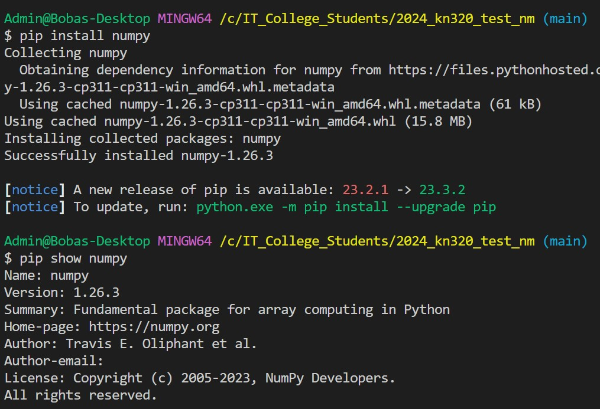
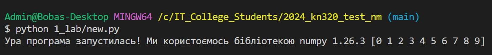
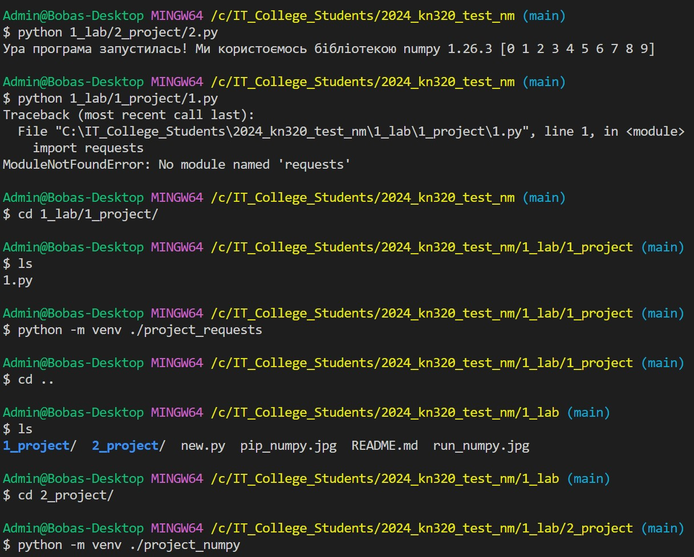
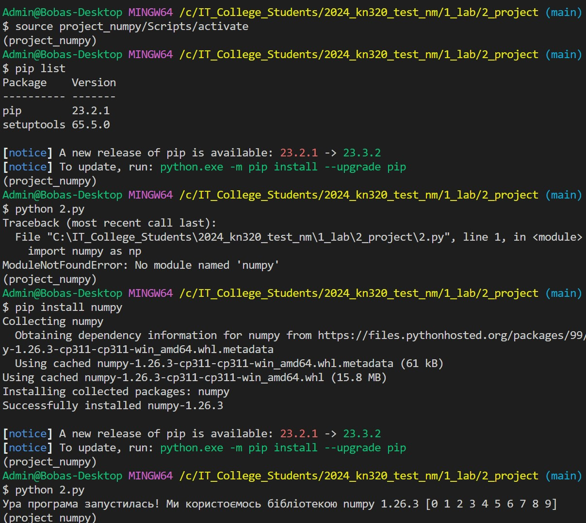
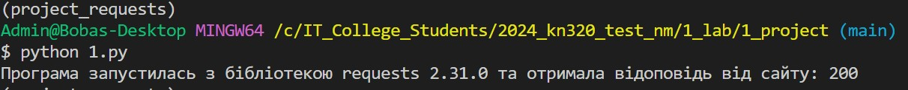
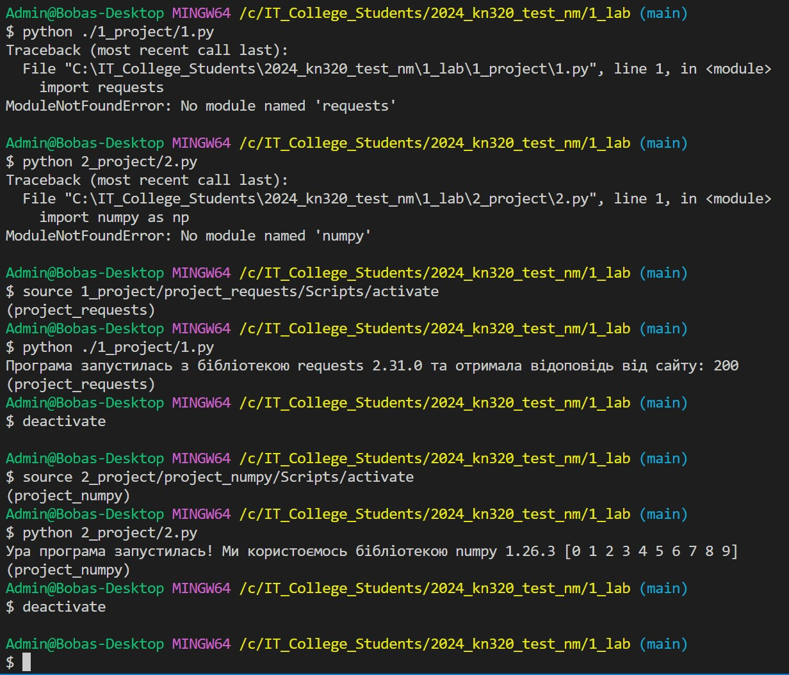
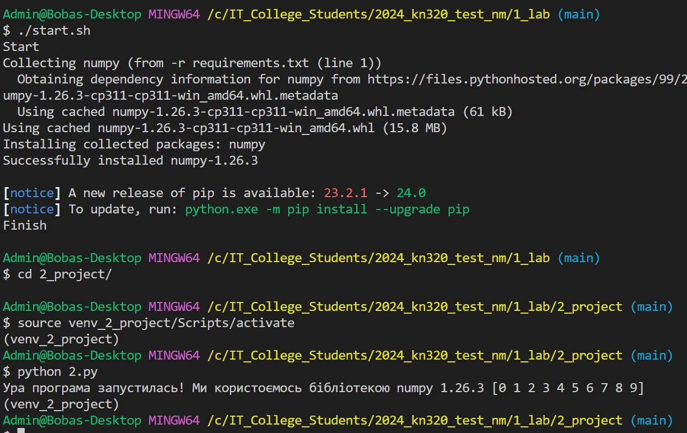
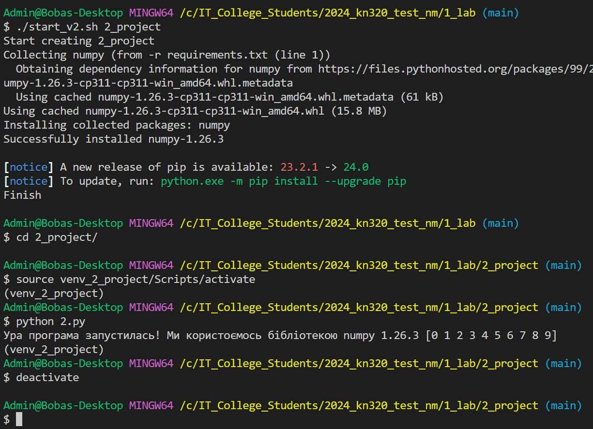

# Звіт до роботи
## Тема: _Робота у віртуальних середовищах Python_
### Мета роботи: _Навчитись створювати та працювати у віртуальних середовищах Python_

---
### Виконання роботи
* Результати виконання завдання:
    1. Розглянули що таке віртуальні середовища. Запитались у ChatGPT про пояснення:
        > `У мові програмування Python віртуальні середовища — це ізольовані області, де можна установлювати та використовувати певні версії бібліотек та пакетів. Вони дозволяють уникнути конфліктів між різними проектами, оскільки кожен проект може мати своє власне середовище зі своїми залежностями.`
    1. Спробували інсталювати пакети за допомогою утиліти pip, для цього виконали наступні команди у терміналі:
        ```bash
        pip install numpy
        pip show numpy
        ```
        - Результат виконання команд наступний
        
        - Після цього ми змогли виконати програму на Python
        
    1. Ми створили декілька проектів які будуть потребувати різних бібліотек, які не встановлені глобально. Тому програми не будуть виконуватись якщо у нас немає віртуальних середовищ.
    1. Будемо створювати віртуальні середовища за допомогою наступних команд:
        ```bash
        cd 1_lab/1_project/
        ls
        python -m venv ./project_requests
        cd ..
        cd 2_project/
        python -m venv ./project_numpy
        ```
        - результат виконання команд наступний
        
    1. Створили та активували проект з використання бібліотеки numpy:
        
    1. Також активували проект для requests:
        
    1. Робота з віртуальними середовищами тепер полягає у переключенні між ними, ми виконуємо активацію цих середовищ щоб мати змогу працювати з конкретним проектом. Приклад такої роботи нижче
        

    1. При копіюванні нашого репозиторію на новий ПК віртуальне середовище не буде присутнім і його потрібно кожен раз створювати. Для того щоб автоматизувати процес створення локального віртуального мередовища ми створимо Баш скрип який знаходиться у файлі [set-up](./1_project/set-up.sh).
        1. Для того щоб створити середовище та розпочати роботі нам потрібно:
            ```bash
            cd 1_project
            ./set-up.sh
            # Далі можемо працювати із середовищем
            source project_requests/Scripts/activate
            python 1.py
            deactivate
            ```
        1. Для середовища 2 ми використовували бульш загальний метод та помістили всі потрібні середовище бібліотеки у файл [requirements.txt](./2_project/requirements.txt) та написали новий скрипт [start.sh](./start.sh) який вже буде створювати середовище враховуючи даний файл. Для того щоб працювати у проекті 2 нам потрібно виконати наступні команди:
            ```bash
            ./start.sh
            # Після цього ми можемо починати працювати у середовищі
            cd 2_project
            source venv_2_project/Scripts/activate
            python 2.py
            deactivate
            ```
        1. Результат початку роботи у середовищі 2 представлено 
    1. Модифікуємо скрипт start.sh так щоб за допомогоюб нього можна було створювати локальні віртуальні середовища для різних проектів. Скрипт перепишемо та переназвемо наступним чином [start_v2.sh](./start_v2.sh).
        1. У проекті 1 ми достворили [requirements.txt](./1_project/requirements.txt) та вказали правильні бібліотеки.
        1. У [start_v2.sh](./start_v2.sh) ми зробили можливим передачу одного аргумента який буде відповідати за назву поточної папки проекту. Тому створення віртуального середовища буде відбуватись наступними командами:
            ```bash
            # Для проекту 1 буде
            ./start_v2.sh 1_project
            # Для проекту 2  буде
            ./start_v2.sh 2_project
            ```
        1. Результат створення проекту 2 за допомогою єдиного скрипта представлено на сріншоті 
    
    
    
    
    
    
    1. Розробили/Створили ...
    1. Програма вивела значення ...
    1. Отримано наступні результати ...
    1. Навчились ...
* вставлені рисунки (скріншоти екрана або фотографії виконаного завдання у зошиті);
    > якщо графічних файлів багато то краще помістити їх у  окрему папку, наприклад у мене це папка `pictures`. Уважно   дивіться коли вставляєте URL - файл має бути представленим    як `raw`. А краще користуйтесь локальними шляхами!

* з використанням URL 
    
* через локальні шляхи 

* вставлений код / текстовий або числовий результат / інші результати:
    - так можна вставляти код, або просто вствляйте посилання на файл з програмою;
    ```python
    def simple_function_example():
        pass
    ```
    - якщо потрібно виділити текст, тоді:
    ```text
    << Тут можна писати те що хочемо виокремити >>
    ```

* результати виконання індивідуального завдання (якщо такі є);

---
### Висновок:
> у висновку потрібно відповісти на запитання:

- :question: Що зроблено в роботі;
- :question: Чи досягнуто мети роботи;
- :question: Які нові знання отримано;
- :question: Чи вдалось відповісти на всі питання задані в ході роботи;
- :question: Чи вдалося виконати всі завдання;
- :question: Чи виникли складності у виконанні завдання;
- :question: Чи подобається такий формат здачі роботи (Feedback);
- :question: Побажання для покращення (Suggestions);

---
