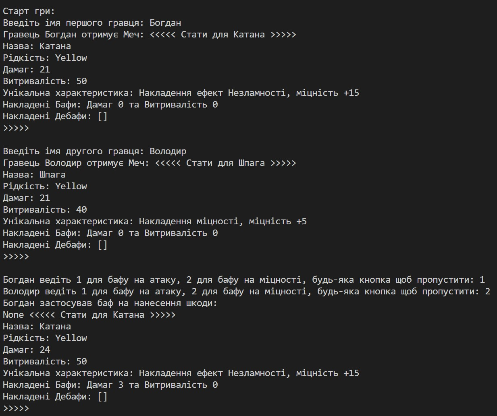

# Звіт до роботи №2
## Тема: _Базові навички роботи з класами в Python_
### Мета роботи: _Навчитись створювати та працювати з класами, розуміти основи ООП, і вміти використовувати класи для тестування програм, та створити програму яку будемо використовувати для тестування_

---
### Виконання роботи
* Результати виконання завданнь:
    1. Створили файл ноутбука для тестування окремих кусків коду та їх функціоналу [nb.ipynb](./nb.ipynb);
    1. Використовуючи ООП написали клас який описує предмет Меча, та додали ще один клас який реалізує бонуси для Меча;
    1. Реалізацю Меча та Бонусів ми винесли в окремий модуть який знаходиться в папці [game](./game/sword.py);
    1. Написали гру яка реалізує бій на мечах двома гравцями. Код гри поміщено у файлі [app.py](./app.py);
    1. Запустили гру та продемонстрували як 2 гравці можуть позмагатись на мечах;
    1. Програма вивела наступне 
    1. В наступних роботах будемо писати тести та виловлювати баги в нашій грі;
    1. Навчились ...

---
### Висновок:
> ПИШІТЬ ВИСНОВКИ ПО РОБОТІ:

- :question: Що зроблено в роботі;
- :question: Чи досягнуто мети роботи;
- :question: Які нові знання отримано;
- :question: Чи вдалось відповісти на всі питання задані в ході роботи;
- :question: Чи вдалося виконати всі завдання;
- :question: Чи виникли складності у виконанні завдання;
- :question: Чи подобається такий формат здачі роботи (Feedback);
- :question: Побажання для покращення (Suggestions);

---